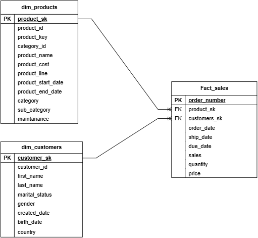

# Bike Lakehouse Pipeline with Databricks

## Project Overview

This project is an end-to-end data engineering pipeline built on Databricks, following the Medallion Architecture (Bronze, Silver, Gold).

It demonstrates how raw data from two source systems (ERP and CRM) is ingested into a Lakehouse environment, then progressively transformed and refined into structured, analytics-ready datasets.

The data flows through three layers:
- Bronze layer: Raw, unprocessed data as ingested from source systems
- Silver layer: Cleaned, validated, and standardized data
- Gold layer: Business-ready, aggregated data optimized for analytics and reporting

This project showcases modern data engineering practices including data ingestion, transformation, data modeling, and pipeline automation within a production-style Databricks environment.

---
## Architecture (Medallion Architecture)

### Bronze Layer (Raw Data)
- Stores raw ingested data exactly as received from the source systems (ERP and CRM).
- No transformation are applied to this layer to keep data as is from source system before we do transformations.
- Acts as the single source of truth for historical data.
- Data is ingested in its original format as CSV files, and the final output is stored in Delta format.

### Silver Layer
- The silver layer reads the data from the bronze layer to start with the transformations.
- Transformation or data quality checks that where done more in details in the bike_lakehouse_2026/silver/data_quality_analysis.md file:
    - finding duplicates (deduplication)
    - Validating String Values:
        - checking extra white spaces
        - identifying abbreviations to normalise
    - Validating date values
        - Check Data Type
        - check the date format
        - Handle missing values
        - fixed the incorrect years on the dates.
    - Validating numeric values
    - Standardising business key ID's to ensure tables can be joined correctly

### Gold Layer
Contains curated business-ready tables optimized for analytics and reporting.
- Mapping each table to a business object such as customers, products, or sales.
- Model our tables:
Entity relation diagram


---

# Data Flow

## Overview

Data flows through three medallion architecture layers **Bronze**, **Silver**, and **Gold**; moving from raw ingestion through transformation to analytics-ready business objects.

## Bronze Layer: Raw Ingestion

Source data is extracted from the **ERP** and **CRM** systems as CSV files and landed into dedicated volumes within the Bronze schema (`source_systems`). These files are then loaded into the Bronze schema and persisted as **Delta tables** with no transformations applied. The Bronze layer serves as a faithful mirror of the source systems, preserving data in its original state.


## Silver Layer: Cleansing & Transformation

Data from the Bronze Delta tables is read, cleaned, and transformed into well-structured, validated datasets. This layer applies data quality rules, standardises formats, and resolves inconsistencies, producing six refined Silver tables ready for modelling.


## Gold Layer: Business Objects & Analytics

The six Silver tables are joined and modelled into core business objects aligned to analytics use cases:

| Gold Table       | Description                        |
|------------------|------------------------------------|
| `dim_customers`  | Customer dimension                 |
| `dim_products`   | Product dimension                  |
| `fact_sales`     | Sales fact table                   |

These Gold tables represent the **final, analytics-ready product** optimised for reporting, dashboards, and downstream consumption.

---

# Pipeline Design

## Overview

The pipeline is orchestrated across three sequential stages **Bronze**, **Silver**, and **Gold** where each stage triggers the next upon successful completion. It was built and scheduled in the **Jobs & Pipelines** section of Databricks.

---

## Execution Flow

### Stage 1 Bronze: Source Ingestion
The pipeline begins by executing the Bronze notebook, which loads raw source data from the CSV files into the Bronze Delta tables.

### Stage 2 Silver: Cleansing & Transformation
On successful completion of the Bronze stage, the Silver orchestration notebook is triggered. It runs **6 Silver notebooks** in sequence, each reading from the Bronze tables, applying transformations and standardisations, and writing the results to their respective Silver tables.

### Stage 3 Gold: Modelling
Once the Silver stage completes, the Gold orchestration notebook is triggered. It runs **3 Gold notebooks** that model the Silver tables into the final three Gold tables `dim_customers`, `dim_products`, and `fact_sales`.

## Scheduling & Monitoring

| Property        | Details                                      |
|-----------------|---------------------------------------------|
| **Platform**    | Databricks Jobs & Pipelines                 |
| **Schedule**    | Daily at 01:00 UTC+2                        |
| **Run Type**    | Batch                                       |
| **Purpose**     | Simulates production-grade batch processing |

The pipeline is actively monitored and iteratively improved to ensure reliability and performance.

---

# Tech Stack

| Technology | Purpose |
|---|---|
| PySpark | Distributed data processing |
| Databricks | Data engineering platform |
| Delta Lake | ACID storage layer |
| Notebooks | Pipeline development |
| SQL | Data transformations |
| Git & GitHub | Version control |

---

---
# Project Structure

```bash
.
├── bike_lakehouse_2026/
│   ├── bronze/
│   │   ├── bronze_config.py
│   │   └── Bronze.ipynb
│   │
│   ├── silver/
│   │   ├── data_quality_analysis.md
│   │   ├── silver_crm_cust_info.ipynb
│   │   ├── silver_crm_prd_info.ipynb
│   │   ├── silver_crm_sales_details.ipynb
│   │   ├── silver_erp_cust_az12.ipynb
│   │   ├── silver_erp_loc_a101.ipynb
│   │   ├── silver_erp_px_catg.ipynb
│   │   └── silver_orchestration.ipynb
│   │
│   ├── gold/
│   │   ├── dim_customers.ipynb
│   │   ├── dim_products.ipynb
│   │   ├── fact_sales.ipynb
│   │   └── gold_orchestration.ipynb
│
├── images/
│   └── bk_entity_diagram.png
│
└── README.md
